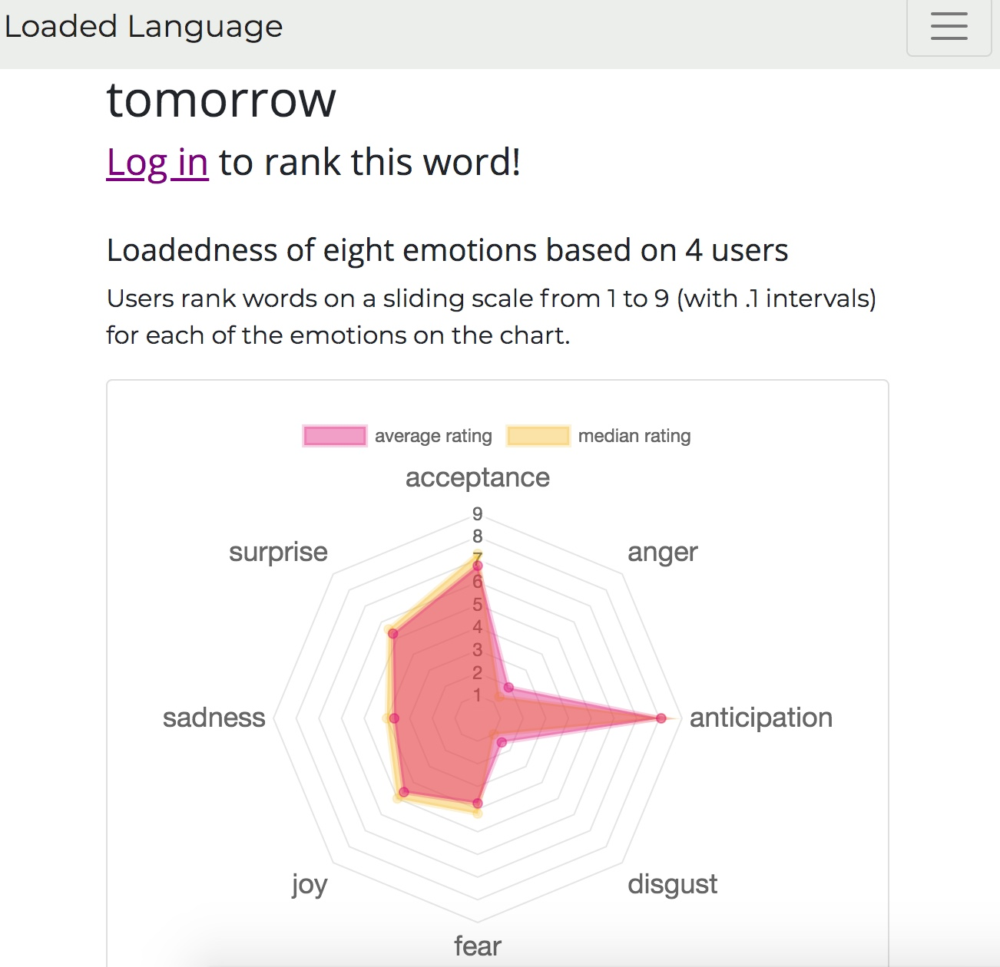
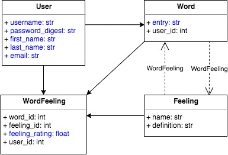

## Project Status: Work in Progress
# Loaded Language
###### https://loaded-language.herokuapp.com/

App to crowdsource a database of words ranked by how strongly they evoke [eight primary emotions](https://en.wikipedia.org/wiki/Contrasting_and_categorization_of_emotions#Plutchik.27s_wheel_of_emotions). The app:
- is built in Rails MVC framework with a PostgreSQL database,
- visualizes data via Chart.js and the `chart-js-rails` gem, and
- is hosted on Heroku.

The database of words is public; visitors can view a spider plot depicting the mean and median 'loadedness' of the eight emotions for individual words. To participate in the project, visitors may:

- sign up with a secure password via the `bcrypt` gem, or
- log in with Google via the `omniauth-google-oauth2` gem;
- once logged in, users may new add words and rank existing words.

###### Basic class diagram and Active Record associations:

>Solid one-directional arrows denote a `has_many`/`belongs_to` association. Dotted one-directional arrows denote a `has_many :through` relationship, or a many-to-many association via a join table. The  blue text denotes user-submitted attributes.
